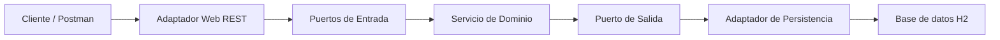

# Taller Post-Contenido 2 - Unidad 7
## Modulo de Productos con Arquitectura Hexagonal

Este proyecto corresponde al taller de la **Unidad 7: Patrones Arquitectonicos I** del curso **Patrones de Diseno de Software**.

La aplicacion implementa un **modulo de gestion de productos** usando **arquitectura hexagonal (Ports & Adapters)** con **Spring Boot**, separando estrictamente el dominio de los detalles tecnicos de infraestructura.

## Objetivo

Implementar una API REST para la gestion de productos, aplicando arquitectura hexagonal mediante:

- puertos de entrada para los casos de uso
- puertos de salida para el acceso a persistencia
- adaptador web REST
- adaptador de persistencia JPA
- un dominio puro, sin dependencias de Spring ni JPA

## Tecnologias utilizadas

- Java 17
- Spring Boot 3.x
- Spring Web
- Spring Data JPA
- H2 Database
- Maven
- Postman

## Estructura del proyecto

```text
com.example.hexagonal
├── domain
│   ├── model
│   │   ├── Producto.java
│   │   ├── PrecioInvalidoException.java
│   │   ├── ProductoNotFoundException.java
│   │   └── StockInsuficienteException.java
│   ├── port
│   │   ├── in
│   │   │   ├── CrearProductoUseCase.java
│   │   │   ├── ListarProductosUseCase.java
│   │   │   └── ActualizarStockUseCase.java
│   │   └── out
│   │       └── ProductoRepositoryPort.java
│   └── service
│       └── ProductoDomainService.java
├── adapter
│   ├── in
│   │   └── web
│   │       ├── GlobalExceptionHandler.java
│   │       └── ProductoController.java
│   └── out
│       └── persistence
│           ├── ProductoJpaEntity.java
│           ├── ProductoJpaRepository.java
│           └── ProductoRepositoryAdapter.java
├── config
│   └── BeanConfiguration.java
└── HexagonalApplication.java
```

## Arquitectura hexagonal

La arquitectura hexagonal busca que el dominio sea el centro del sistema y no dependa de frameworks ni de detalles tecnicos.

### Dominio
Ubicado en `domain/`.

Responsabilidades:
- definir el modelo `Producto`
- contener la logica de negocio
- declarar excepciones del negocio
- declarar puertos de entrada y salida

### Puertos de entrada
Ubicados en `domain/port/in/`.

Representan los casos de uso del sistema:
- crear producto
- listar productos
- buscar producto por ID
- reducir stock

### Puerto de salida
Ubicado en `domain/port/out/`.

Define lo que el dominio necesita de la persistencia, sin conocer JPA ni Spring Data.

### Adaptador de entrada
Ubicado en `adapter/in/web/`.

Responsabilidades:
- recibir peticiones HTTP
- traducirlas a llamadas a los casos de uso
- devolver respuestas REST

### Adaptador de salida
Ubicado en `adapter/out/persistence/`.

Responsabilidades:
- persistir productos en la base de datos
- mapear entre `Producto` del dominio y `ProductoJpaEntity`

### Configuracion
Ubicada en `config/`.

Responsabilidades:
- registrar manualmente los beans del dominio
- conectar Spring con la arquitectura hexagonal

## Diagrama de arquitectura



## Modelo de dominio

La entidad principal es `Producto`, compuesta por:

- `id`: identificador unico
- `nombre`: nombre del producto
- `descripcion`: descripcion del producto
- `precio`: valor monetario del producto
- `stock`: cantidad disponible

### Reglas de negocio

- el precio debe ser mayor a cero
- no se puede reducir mas stock del disponible
- un producto esta disponible cuando su stock es mayor que cero

## Configuracion

Archivo `application.properties`:

```properties
spring.application.name=hexagonal

spring.datasource.url=jdbc:h2:mem:productosdb
spring.datasource.driverClassName=org.h2.Driver
spring.datasource.username=sa
spring.datasource.password=

spring.h2.console.enabled=true
spring.h2.console.path=/h2-console

spring.jpa.hibernate.ddl-auto=update
spring.jpa.show-sql=true
spring.jpa.properties.hibernate.format_sql=true
```

## Como ejecutar el proyecto

1. Clonar o descargar el repositorio
2. Abrir el proyecto en VS Code o IntelliJ IDEA
3. Ubicarse en la raiz del proyecto, donde esta el archivo `pom.xml`
4. Compilar el proyecto con:

```bash
mvn clean package
```

5. Ejecutar la aplicacion con:

```bash
mvn spring-boot:run
```

## Accesos importantes

- API REST: [http://localhost:8080/api/productos](http://localhost:8080/api/productos)
- Consola H2: [http://localhost:8080/h2-console](http://localhost:8080/h2-console)

### Datos para ingresar a H2 Console

- JDBC URL: `jdbc:h2:mem:productosdb`
- User Name: `sa`
- Password: dejar vacio

## Endpoints disponibles

### Listar productos
- Metodo: `GET`
- URL: `/api/productos`

### Buscar producto por ID
- Metodo: `GET`
- URL: `/api/productos/{id}`

### Crear producto
- Metodo: `POST`
- URL: `/api/productos`

Ejemplo de body:

```json
{
  "nombre": "Laptop",
  "descripcion": "Laptop para desarrollo",
  "precio": 2500.00,
  "stock": 10
}
```

### Reducir stock
- Metodo: `PATCH`
- URL: `/api/productos/{id}/stock?cantidad=3`

## Pruebas realizadas en Postman

### 1. Listar productos vacios
**Request**
```http
GET /api/productos
```

**Respuesta esperada**
- `200 OK`

```json
[]
```

### 2. Crear producto valido
**Request**
```http
POST /api/productos
```

```json
{
  "nombre": "Laptop",
  "descripcion": "Laptop para desarrollo",
  "precio": 2500.00,
  "stock": 10
}
```

**Respuesta esperada**
- `201 Created`

### 3. Buscar producto por ID
**Request**
```http
GET /api/productos/1
```

**Respuesta esperada**
- `200 OK`

### 4. Reducir stock correctamente
**Request**
```http
PATCH /api/productos/1/stock?cantidad=3
```

**Respuesta esperada**
- `200 OK`

### 5. Reducir stock con cantidad mayor al disponible
**Request**
```http
PATCH /api/productos/1/stock?cantidad=50
```

**Respuesta esperada**
- `400 Bad Request`

```json
{
  "error": "Stock insuficiente. Disponible: 7"
}
```

### 6. Crear producto con precio invalido
**Request**
```http
POST /api/productos
```

```json
{
  "nombre": "Mouse",
  "descripcion": "Mouse gamer",
  "precio": 0,
  "stock": 5
}
```

**Respuesta esperada**
- `400 Bad Request`

```json
{
  "error": "El precio debe ser mayor a cero"
}
```

## Checkpoints verificados

- el proyecto compila con `mvn clean package`
- `GET /api/productos` retorna una lista vacia al inicio
- `POST /api/productos` crea un producto correctamente
- `PATCH /api/productos/{id}/stock` valida el stock disponible
- las clases en `domain/` no importan Spring ni JPA
- `ProductoDomainService` puede instanciarse sin `@SpringBootTest`
- el adaptador de persistencia traduce correctamente entre dominio y entidad JPA


## Entregables

- repositorio publico en GitHub
- nombre sugerido del repositorio: `apellido-post2-u7`
- codigo fuente Maven
- `README.md`
- capturas de pruebas realizadas
- minimo 3 commits descriptivos

## Conclusiones

Este taller permite aplicar la arquitectura hexagonal en un proyecto real con Spring Boot.
La separacion entre dominio, puertos y adaptadores mejora la mantenibilidad, testabilidad y desacoplamiento del sistema.

## Autor

- Nombre: Jair Sanjuan
- Curso: Patrones de Diseno de Software
- Unidad: 7
- Actividad: Post-Contenido 2
